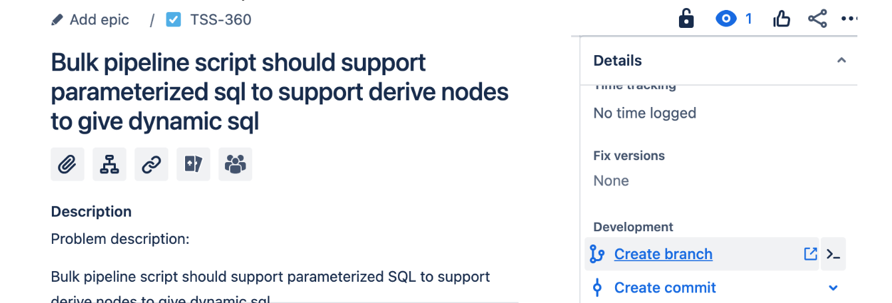
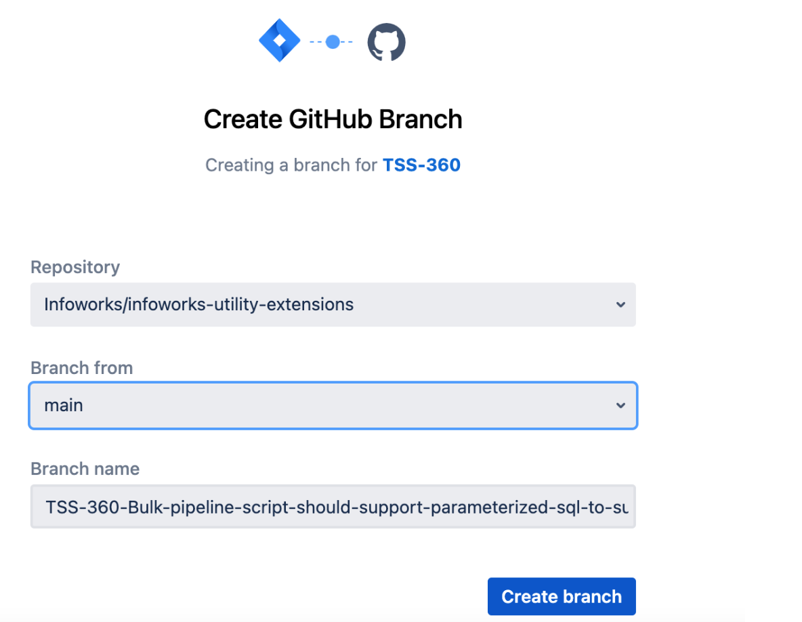

# Contributing

Thanks for your interest in contributing to the Infoworks Utility Extensions repo!

## To get started contributing:

1) Sign a Contributor License Agreement (see details below).
2) Fork the repo, develop and test your code changes.

3) Develop using the following guidelines to help expedite your review:
    - Ensure that your code adheres to the existing [style](https://google.github.io/styleguide).
    - Ensure that your code has an appropriate set of unit tests which all pass.
    - Ensure that your code has an accompanying README.md file with instructions on usage. See [awesome-readme](https://github.com/matiassingers/awesome-readme) for good examples of high-quality READMEs.
    - Ensure that you've added a link to your contribution in the top-level [README](./README.md) (alpha-order).
    - Ensure that your submission does not include a LICENSE file. There's no need to include an additional license since all repository submissions are covered by the top-level Apache 2.0 [license](./LICENSE).
4) Submit a pull request.

## Overview
This document outlines the branching strategy to be followed in the development of the infoworks-utility-extensions project hosted on GitHub. A well-defined branching strategy helps manage concurrent development, releases, and collaboration among team members.
- Github Repository Details

https://github.com/Infoworks/infoworks-utility-extensions

## Prerequisites

Every Contributor must install the below python modules for the first time before performing any git actions.
This will install the pre-commit utility which will avoid anyone accidentally committing secrets to the repository.
```shell
pip install detect-secrets
pip install pre-commit
pre-commit install
```

## Table of Contents
- [Branch Types](#branch-types)
- [Branch Naming Convention](#branch-naming-convention)
- [Main Branch](#main-branch)
- [Feature Branches](#feature-branches)
- [Release Branches](#release-branches)
- [Hotfix Branches](#hotfix-branches)
- [Pull Request (PR) Process](#pull-request-process)
- [Example Workflow](#example-workflow)
- [Best Practices](#best-practices)
- [Contribution guidelines for Infoworks Employees](#contribution-guidelines-for-infoworks-employees)

1. **Branch Types**
- *Main Branch*: Represents the production-ready code.
- *Feature Branch*: Used for developing new features.
- *Release Branch*: Contains code that is being prepared for a release.
- *Hotfix Branch*: Created to fix critical issues in the production code.
2. **Branch Naming Convention**
- *Main Branch*: main
- *Feature Branch*: feature/{feature-name} eg: feature/support-special-char
- *Release Branch*: release/{iwx-version} eg: release/5.5.0.1
- *Hotfix Branch*: hotfix/{TSS-issue-number} eg: hotfix/TSS-110
3. **Main Branch**
- The main branch always reflects the production-ready state.
- Developers should not directly commit to the main branch.
4. **Feature Branches**
- Branch off from main.
- Name should be in the format feature/{feature-name}.
- Merge back into main through a pull request.
5. **Release Branches**
- Branch off from main when preparing for a release.
- Name should be in the format release/{version}.
- Only bug fixes and documentation updates should be allowed in release branches.
- Merge back into main and create a tag for the release.
6. **Hotfix Branches**
- Branch off from main to fix critical issues in production.
- Name should be in the format hotfix/{TSS-issue-number}.
- Merge back into main and also merge changes into the active release branch if applicable.
7. **Pull Request (PR) Process**
- All code changes must go through a pull request.
- Code reviews are mandatory before merging.
- Include unit tests and update documentation as necessary.
- Squash or rebase commits before merging.
8. **Example Workflow**
- Create a new feature branch: git checkout -b feature/new-feature.
- Make changes and commit: git commit -m "Implemented new-feature".
- Push the feature branch to the remote repository: git push origin feature/new-feature.
- Create a pull request on GitHub.
- Request code review.
- After approval, merge into main.
9. **Best Practices**
- Keep branches small and focused on specific tasks.
- Regularly sync feature branches with main.
- Automate testing and integration processes.
- Document the branching strategy and update as needed.
10. **Contribution guidelines for Infoworks Employees**
If you are an Infoworks Employee below are the guidelines for contribution:
- Navigate to the your enhancement/bug request registered in JIRA: For Example :https://infoworks.atlassian.net/browse/TSS-000
- Click on Create Branch option on the Details section



- Select the Repository name and the Branch from which you would like to branch the code



- Click on Create branch. This will automatically create the github branch for you.
- Subsequently, you can proceed with your regular development tasks on the new feature branch, and all commits and pull requests will be logged and associated with specific Jira issues.

## Conclusion
Adhering to this branching strategy will contribute to a streamlined development process, effective collaboration, and a more stable production environment. Regularly review and update this document to reflect any changes in the development workflow.


