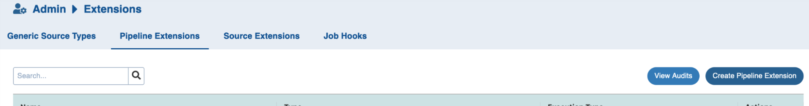
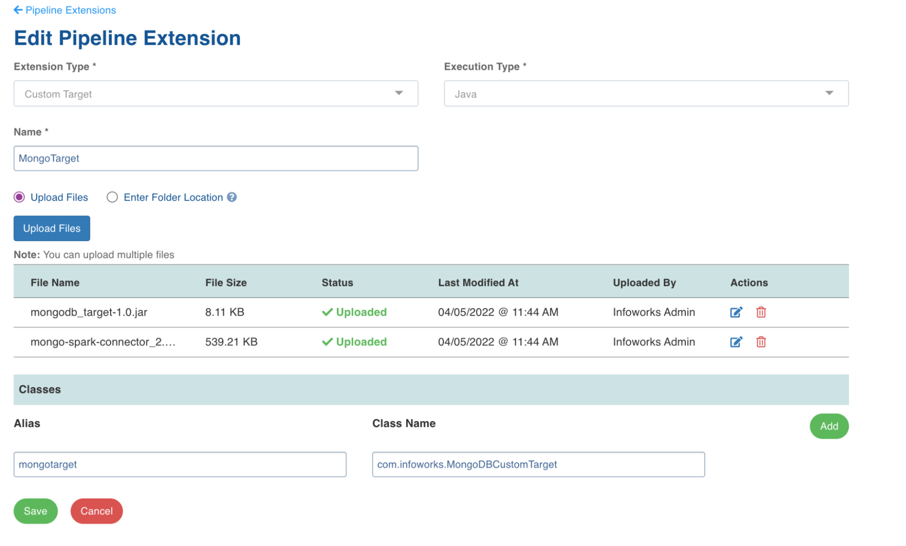
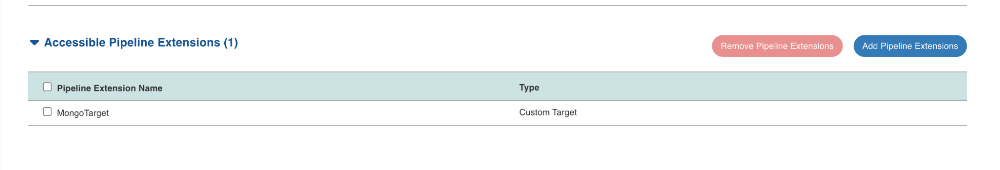
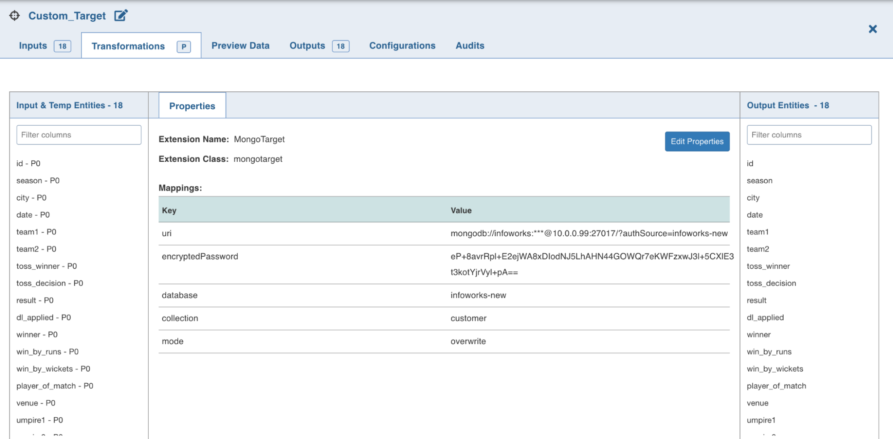
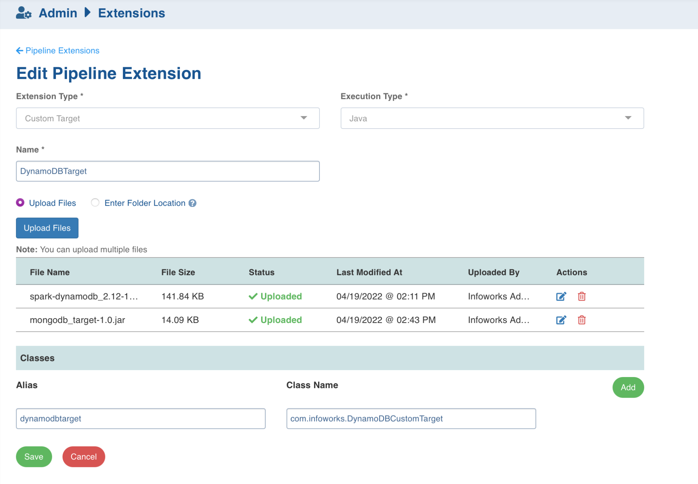
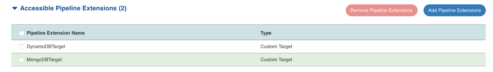
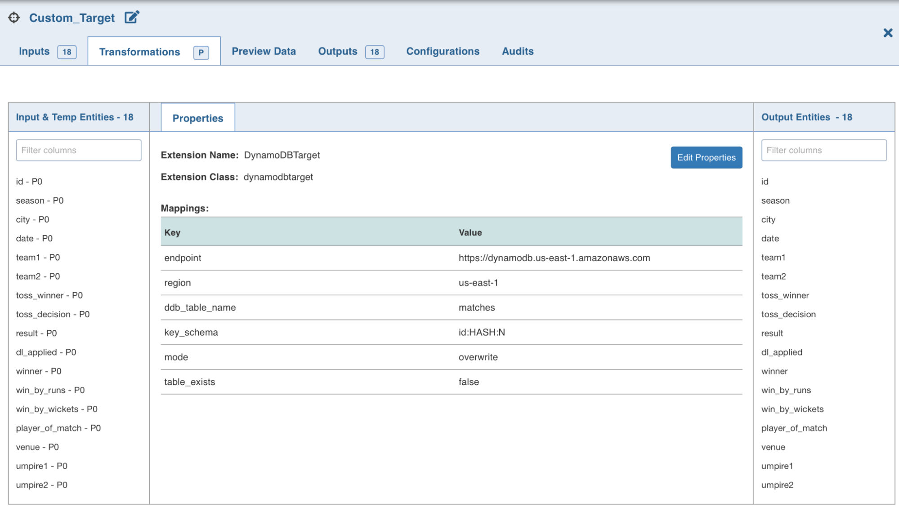

<html>
    <head>
        <meta content="text/html; charset=UTF-8" http-equiv="content-type" />
    </head>
    <body style="width: 100%;" class="c2 doc-content">
        
<h1>Infoworks Custom Target for MongoDB</h1>

        

        
Infoworks custom target solution to write the pipeline data to MongoDB in OVERWRITE/APPEND/MERGE mode.

        <h1 class="c24 c6" id="h.pjv8tujelwqn">Step 1: Create Pipeline Extension</h1>
        
Download the jars from the below link and upload them as shown below

        

        

            Admin &gt; Extensions &gt; Pipeline Extension &gt; Create pipeline Extension
            
                
            
        

        

        

            
                
            
        

        

        

        

        <h1 class="c24 c6" id="h.wyfbk81uk61h">Step 2: Add Pipeline Extension to Domain</h1>
        

        

            Go to&nbsp;Manage Domains&nbsp;&gt; Edit the domain with the pipeline
            &nbsp;&gt; click on manage artifacts&nbsp;&gt; Add the pipeline extension to the domain
        

        

        

            
                
            
        

        <h1 class="c6 c24" id="h.lzvb045f7fxg">Step 3: Configure the Custom Target using the Pipeline Extension</h1>
        

        

            
                
            
        

        

        
Available keys to configure

        

        
        <table class="c47">
            <tr class="c50">
                <td class="c39" colspan="1" rowspan="1">
                    
KEY

                </td>
                <td class="c37" colspan="1" rowspan="1">
                    
DESCRIPTION

                </td>
            </tr>
            <tr class="c5">
                <td class="c16" colspan="1" rowspan="1">
                    
uri

                </td>
                <td class="c12" colspan="1" rowspan="1">
                    
Pass the mongodb uri in the format: (Note: password field will always remain ***)

                    
mongodb://{username}:***@{hostname}:{port}/?authSource={auth_db}

                </td>
            </tr>
            <tr class="c22">
                <td class="c16" colspan="1" rowspan="1">
                    
encryptedPassword

                </td>
                <td class="c12" colspan="1" rowspan="1">
                    
Pass the encrypted password by running the command in edge node (IN11**rk is the actual password)

                    
bash /opt/infoworks/apricot-meteor/infoworks_python/infoworks/bin/infoworks_security.sh -encrypt -p IN11**rk

                </td>
            </tr>
            <tr class="c19">
                <td class="c16" colspan="1" rowspan="1">
                    
database

                </td>
                <td class="c12" colspan="1" rowspan="1">
                    
Database to which we need to connect

                </td>
            </tr>
            <tr class="c19">
                <td class="c16" colspan="1" rowspan="1">
                    
collection

                </td>
                <td class="c12" colspan="1" rowspan="1">
                    
Collection to which the data has to be written

                </td>
            </tr>
            <tr class="c19">
                <td class="c16" colspan="1" rowspan="1">
                    
mode

                </td>
                <td class="c12" colspan="1" rowspan="1">
                    
overwrite/append/merge

                </td>
            </tr>
            <tr class="c19">
                <td class="c16" colspan="1" rowspan="1">
                    
merge_key

                </td>
                <td class="c12" colspan="1" rowspan="1">
                    
Comma separated column names on which merge has to be performed

                </td>
            </tr>
            <tr class="c19">
                <td class="c16" colspan="1" rowspan="1">
                    
index_key

                </td>
                <td class="c12" colspan="1" rowspan="1">
                    
Column name on which index has to be created

                </td>
            </tr>
            <tr class="c19">
                <td class="c16" colspan="1" rowspan="1">
                    
table_exists

                </td>
                <td class="c12" colspan="1" rowspan="1">
                    
true/false. If True the collection and index won&#39;t be dropped from MongoDB

                </td>
            </tr>
        </table>
        

        

        <h1 class="c24 c6" id="h.5008bpier8dl">Notes:</h1>
        

        
Jars to upload can be found here: 

        

        

            
                <a class="c34" href="https://www.google.com/url?q=https://infoworks-releases.s3.amazonaws.com/MongoTarget.zip&amp;sa=D&amp;source=editors&amp;ust=1713324872103254&amp;usg=AOvVaw27RQY0WuUHvpAjZ8nESFqv">
                    https://infoworks-releases.s3.amazonaws.com/MongoTarget.zip
                </a>
            
        

        

        

        
References:

        

            
                <a
                    class="c34"
                    href="https://www.google.com/url?q=https://www.mongodb.com/docs/spark-connector/current/configuration/%23std-label-spark-output-conf&amp;sa=D&amp;source=editors&amp;ust=1713324872103838&amp;usg=AOvVaw2W-ztnwTSpN-wP9HcSE5ll"
                >
                    https://www.mongodb.com/docs/spark-connector/current/configuration/#std-label-spark-output-conf
                </a>
            
        

        

        

        

        

        

        

        

        

        

        

        

        

        

        

        
<h1>Infoworks Custom Target for DynamoDB</h1>

        

        
Infoworks custom target solution to write the pipeline data to DynamoDB in OVERWRITE/UPSERT/INSERT ONLY mode.

        <h1 class="c24 c6" id="h.fl0jlrv779n5">Prerequisites</h1>
        

        <ol class="c44 lst-kix_doqib9utnpku-0 start" start="1">
            <li class="c0 c6 c28 li-bullet-0">IAM role should be attached to the EMR cluster and IWX Edgenode that has access write/read access to DynamoDB tables</li>
            <li class="c0 c28 c6 li-bullet-0">Preferably create DynamoDB tables manually from AWS console/cli as there are multiple options/configs available</li>
        </ol>
        

            
                <a
                    class="c34"
                    href="https://www.google.com/url?q=https://docs.aws.amazon.com/amazondynamodb/latest/APIReference/API_CreateTable.html%23API_CreateTable_RequestSyntax&amp;sa=D&amp;source=editors&amp;ust=1713324872105522&amp;usg=AOvVaw3ReHtCv3hzBnahqgE88Aiz"
                >
                    https://docs.aws.amazon.com/amazondynamodb/latest/APIReference/API_CreateTable.html#API_CreateTable_RequestSyntax
                </a>
            
        

        
For the POC we have just included basic options as we are not sure which are the options used by Aflac.

        <h1 class="c24 c6" id="h.933sr8ijferw">Step 1: Create Pipeline Extension</h1>
        
Download the jars from the below link and upload them as shown below

        

        

            Admin &gt; Extensions &gt; Pipeline Extension &gt; Create pipeline Extension
            
                
            
        

        

        

            
                
            
        

        

        <h1 class="c24 c6" id="h.1us7yj3klfnf">Step 2: Add Pipeline Extension to Domain</h1>
        

        

            Go to&nbsp;Manage Domains&nbsp;&gt; Edit the domain with the pipeline
            &nbsp;&gt; click on manage artifacts&nbsp;&gt; Add the pipeline extension to the domain
        

        

        

            
                
            
        

        <h1 class="c24 c6" id="h.x5175kuy9upu">Step 3: Configure the Custom Target using the Pipeline Extension</h1>
        

        

            
                
            
        

        

        

        
Available keys to configure

        

        
        <table class="c43">
            <tr class="c50">
                <td class="c49" colspan="1" rowspan="1">
                    
KEY

                </td>
                <td class="c37" colspan="1" rowspan="1">
                    
DESCRIPTION

                </td>
            </tr>
            <tr class="c5">
                <td class="c9" colspan="1" rowspan="1">
                    
endpoint

                </td>
                <td class="c12" colspan="1" rowspan="1">
                    
Pass the dynamodb endpoint

                </td>
            </tr>
            <tr class="c22">
                <td class="c9" colspan="1" rowspan="1">
                    
region

                </td>
                <td class="c12" colspan="1" rowspan="1">
                    
Region in which DynamoDB table is hosted

                </td>
            </tr>
            <tr class="c19">
                <td class="c9" colspan="1" rowspan="1">
                    
ddb_table_name

                </td>
                <td class="c12" colspan="1" rowspan="1">
                    
DynamoDB table name

                </td>
            </tr>
            <tr class="c19">
                <td class="c9" colspan="1" rowspan="1">
                    
key_schema

                </td>
                <td class="c12" colspan="1" rowspan="1">
                    
Mandatory input to create table in the format {col_name}:{keytype}:{attributetype}

                    
Example:&nbsp;customer_id:HASH:N

                    
Refer for more details:

                    

                        
                            <a
                                class="c34"
                                href="https://www.google.com/url?q=https://docs.aws.amazon.com/amazondynamodb/latest/APIReference/API_CreateTable.html%23API_CreateTable_RequestSyntax&amp;sa=D&amp;source=editors&amp;ust=1713324872110690&amp;usg=AOvVaw3tfTHQyIGNbRfgwOPjcFM4"
                            >
                                https://docs.aws.amazon.com/amazondynamodb/latest/APIReference/API_CreateTable.html#API_CreateTable_RequestSyntax
                            </a>
                        
                    

                    
We can provide both partition key and sort key details here.

                    
Example: partition_key:HASH:S,sort_key:RANGE:N

                    
You can use the combination of both as primary key or provide only partition key as primary key

                </td>
            </tr>
            <tr class="c19">
                <td class="c9" colspan="1" rowspan="1">
                    
ReadCapacityUnits

                </td>
                <td class="c12" colspan="1" rowspan="1">
                    
The maximum number of strongly consistent reads consumed per second before DynamoDB returns a ThrottlingException. &nbsp;Default: 10

                </td>
            </tr>
            <tr class="c19">
                <td class="c9" colspan="1" rowspan="1">
                    
WriteCapacityUnits

                </td>
                <td class="c12" colspan="1" rowspan="1">
                    
The maximum number of writes consumed per second before DynamoDB returns a ThrottlingException. Default: 10

                </td>
            </tr>
            <tr class="c19">
                <td class="c9" colspan="1" rowspan="1">
                    
mode

                </td>
                <td class="c12" colspan="1" rowspan="1">
                    
overwrite &rarr; Table will be truncated and overwritten

                    
insert &rarr; If there are only inserts then this mode is preferred to be used

                    
upsert &rarr; If there are updates as well as inserts then one can use upsert mode.

                    
Default: overwrite

                </td>
            </tr>
            <tr class="c19">
                <td class="c9" colspan="1" rowspan="1">
                    
table_exists

                </td>
                <td class="c12" colspan="1" rowspan="1">
                    
true/false

                </td>
            </tr>
            <tr class="c19">
                <td class="c9" colspan="1" rowspan="1">
                    
writeBatchSize

                </td>
                <td class="c12" colspan="1" rowspan="1">
                    
Number of items to send per call to DynamoDB BatchWriteItem. Default 25.

                </td>
            </tr>
            <tr class="c19">
                <td class="c9" colspan="1" rowspan="1">
                    
targetCapacity

                </td>
                <td class="c12" colspan="1" rowspan="1">
                    
Fraction of provisioned write capacity on the table to consume for writing or updating. Default 1 (i.e. 100% capacity).

                </td>
            </tr>
            <tr class="c19">
                <td class="c9" colspan="1" rowspan="1">
                    
throughput

                </td>
                <td class="c12" colspan="1" rowspan="1">
                    

                        The desired write throughput to use. It overwrites any calculation used by the package. It is intended to be used with tables that are on-demand. Defaults to 100 for on-demand.
                    

                </td>
            </tr>
        </table>
        

        <h1 class="c24 c6" id="h.7pecyi11m0o9">Notes:</h1>
        

        
Jars to upload can be found here: 

        

        

            
                <a class="c34" href="https://www.google.com/url?q=https://infoworks-releases.s3.amazonaws.com/DynamoDB.zip&amp;sa=D&amp;source=editors&amp;ust=1713324872115629&amp;usg=AOvVaw3gSEw_b79SW3ly_-scNViT">
                    https://infoworks-releases.s3.amazonaws.com/DynamoDB.zip
                </a>
            
        

        

        

    </body>
</html>
