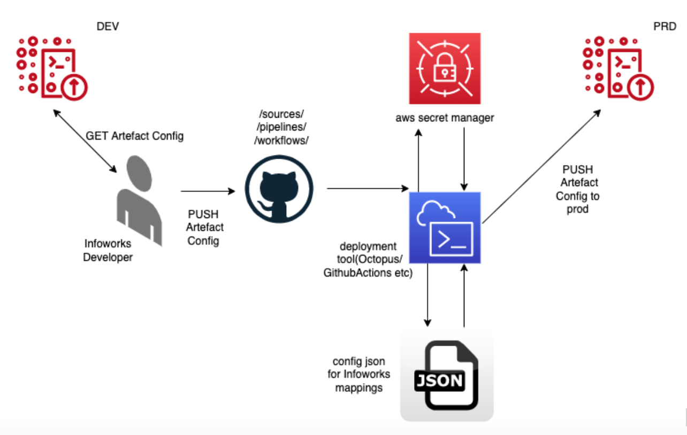
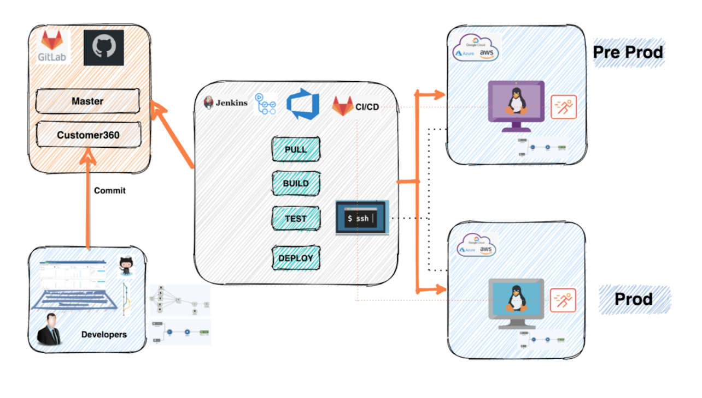
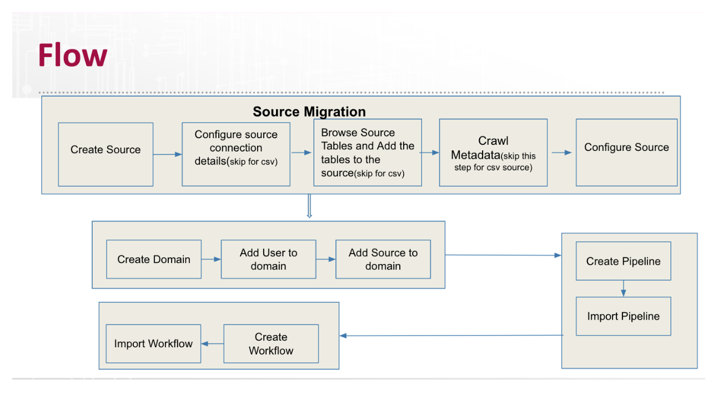

# CI/CD Product Recipe

Product Compatibility: IWX 5.3.1

## Introduction
This product recepie is responsible for migration of Infoworks artifacts from lower environment(Dev/QA) to higher environment(Prod).

<br>
Supports Infoworks version 5.2 onwards

## Table of Contents
- [Introduction](#introduction)
- [Prerequisites](#prerequisites)
- [Installation](#installation)
- [Usage](#usage)
- [Authors](#authors)

# CICD Flow







# Prerequisites

- The deployment server VM should have access to the Github repository and should be given read/write access.
- The deployment server VM should be able to talk to the source and target IWX environments on the 3001/443 port
- The Secrets with the connection details to Pre-Prod/QA environments should be created before executing the migration
- The Target/upper Infoworks Environment version should be the same as the source/lower Infoworks Environment version.
- Infoworks Target Environment should be installed and the environment should be created with the necessary storage and compute interactive cluster.
- The License key should be installed in the Target Infoworks environment with all the required source connector options.
- Ensure that the interactive clusters in both the Source and Target Infoworks Environment are up and running through the migration process. 
- The other infoworks users have to be created in the target environment and the roles and access to the domains should be created post-migration.

# Installation

The script will automatically install infoworkssdk required to perform CICD actions when executed.

# Limitations

Will not migrate Infoworks schedules (typically PROD schedules are different from lower environment schedules)

# What are the considerations and steps for CI/CD process integration with Infoworks?

## Migration of Artifacts

### Sources
- Creates source and maps it with environment
- Configure the connection details for the source
- Browse the source for the tables based on filter criteria if any
- Add the browsed tables and metacrawl the tables
- Configure the tables ingestion configurations(Natural keys,watermark column, split by, partition by, advance configurations, etc.)
- Create and configure the table groups

### Pipelines

- Creates the domain for pipeline if doesn’t exist already
- Creates pipeline and attach it to the compute
- Configure the pipeline using the pipeline model from lower environment
- Advance configuration if any

### Workflows

- Creates workflows
- Configures workflow

# Infoworks Developer CICD flow:

- On your local system, make sure you have a local repository cloned from the remote repository. Then, do the following:
- wget –no-check-certificate https://infoworks-releases.s3.amazonaws.com/customer_cicd_poc.tar.gz
- git checkout the repository branch (preprod or prod) 
- cd to the repo directory.
- Run the get_config_export.py with the below mentioned parameters to export the  required artifacts configurations into individual json files.


# Files/Directory structure

- config.ini: Contains all the parameters and the mappings required for the migration process.
- get_config_export.py: The master script that needs to be executed on your local machine to export the required artfacts into JSON files.
- deployment_plan.py : This script prints the information about the artifacts that will get migration during the current run along with changes provided in config.ini.
- configurations directory: Storage for all the required JSONs of the sources/pipelines/workflows that are exported during the migration process. 

#Usage 
```sh
python3 get_config_export.py --source_ids <source_ids> --pipeline_ids <pipeline_ids> --pipeline_group_ids <pipeline_group_ids> --workflow_ids <workflow_ids> --refresh_token <your_refresh_token> --protocol http --host <hostname> --port <port>
```
## Parameters for the script:

- source_ids :comma separated source ids to be migrated 
- pipeline_ids: comma separated pipeline ids to be migrated
- pipeline_group_ids: comma separated pipeline group ids to be migrated (This will include all the pipelines within pipeline group. Note: Applicable only for Snowflake environment)
- workflow_ids: comma separated workflow ids to be migrated
- refresh_token: your infoworks refresh token from lower environment
- protocol: protocol used to access lower environment(http/https)
- host: host ip of lower environment.
- port: restapi port number of lower environment.(3001 for http and 443 for https)

# Example

```sh
python3 get_config_export.py --source_ids 1d6fae5b9c1d6359d4f0cf1e,dd8b62c3b9455d0b4b016c4d --pipeline_ids 83c15fb2157347a1e4ff030b --workflow_ids 77f68f74d3ec09a4cff076f2 --refresh_token <your_refresh_token> --protocol http --host 10.28.1.163 --port 3001
WARNING: You are using pip version 21.1.1; however, version 22.1.2 is available.
You should consider upgrading via the '/Users/infoworks-user/test_dump/bin/python3 -m pip install --upgrade pip' command.
Dumping file /Users/infoworks-user/configurations/source/source_DEMO_ORACLE.json
Dumping file /Users/infoworks-user/configurations/source/source_DEMO_CSV.json
Dumping file
/Users/infoworks-user/configurations/pipeline/DEMO_DOMAIN#pipeline_DEMO_PIPELINE.json
Dumping file /Users/infoworks-user/configurations/workflow/DEMO_DOMAIN#workflow_DEMO_WORKFLOW.json
(test_dump) IWX-IN-C02WP14TG8WN:~ infoworks-user$
```

### Edit the config.ini as per the mapping needs.

For instance,  you would need to map the preprod environment name to prod environment name, you can do so with the config.ini as follows:

```ini
[api_mappings]
ip=10.28.1.95
port=3001
protocol=http
maintain_lineage=false
refresh_token=zThziQ7MoJJPYAha+U/+PBSTZG944F+SHBDs+m/z2qn8+m/ax8Prpzla1MHzQ5EBLzB2Bw8a+Qs9r6En5BEN2DsmUVJ6sKFb2yI2
env_tag=PRD
[environment_mappings]
PRE_PROD_SNOWFLAKE=PROD_SNOWFLAKE
[storage_mappings]
PRE_PROD_DEFAULT_STORAGE=PROD_DEFAULT_STORAGE
[compute_mappings]
PRE_PROD_DEFAULT_PERSISTENT_COMPUTE=PROD_DEFAULT_PERSISTENT_COMPUTE
[table_group_compute_mappings]
PRE_PROD_DEFAULT_PERSISTENT_COMPUTE=PROD_DEFAULT_PERSISTENT_COMPUTE
DEFAULT_DEMO_COMPUTE_CLUSTER=Default_Persistent_Compute_Template
```

In the above file:

[api_mappings]

Contains information about target machine (host,port,infoworks user refresh token etc)
port: rest api port of lower environment.(3001 for http,443 for https)


Note:
If there are any customer specific changes that are supposed to happen like schema name change during the CICD process they can do so by following the below format for section name in config.ini
```ini
[configuration$source_configs$data_lake_schema]
DEMO_CSV_Schema=DEMO_CSV_Schema_PRD
PUBLIC=PUBLIC_PRD
```

You need to specify the path in the json where the particular key appears separated by $.
For cases where you want to give regex pattern instead of actual key name to match criteria for multiple pipelines you can give regex as follows:

```ini
[configuration$pipeline_configs$model$nodes$SNOWFLAKE_TARGET_.*$properties$database_name]
TEST_DATABASE=PRD_DATABASE
```

In the above example, we can match multiple snowflake target table( SNOWFLAKE_TARGET_ABCD,SNOWFLAKE_TARGET_DEFG etc) properties instead of individually specifying section for each keys.
#### Note:
(The above feature is available only starting from Infoworks SDK versions infoworkssdk >= 3.0a3)

In case the json has array of json values, you could use * instead of giving actual index number in section name of config.ini
For example:
```ini
[configuration$pipeline_configs$pipeline_parameters$*$value]
SUPPORT_DB=PRD_DB
```
“*” in the above section indicates the value variable can be in any index of the pipeline_parameters array.
```json
{
   "configuration": {
       "pipeline_configs": {
           "type": "sql",
           "query": "Y3JlYXRlIHRhYmxlIHNxbF9waXBlbGluZV8xX3RhYmxlIGFzIHNlbGVjdCAqIGZyb20gY3VzdG9tZXJz", //pragma: allowlist secret
           "pipeline_parameters": [
               {
                   "key": "DB_NAME",
                   "value": "SUPPORT_DB"
               }
           ],
           "batch_engine": "SNOWFLAKE",
           "query_tag": "dev",
           "description": ""}}}
```
### Optional step:
Run deployment_plan.py step to print information about what all changes will occur during this run of config migration
```bash
python3 deployment_plan.py
/usr/local/bin/python3.9 /Users/nitin.bs/PycharmProjects/cicd/customer_cicd_poc/deployment_plan.py
Infoworks source RDBMS_SQLServer will be created/updated.Tables and Table groups under it will be configured based on below changes.
Changed data_lake_schema: from public to PUBLIC_PRD
Changed data_lake_schema: from public_cicd_rdbms_demo to PUBLIC_PRD_RDBMS_DEMO
Changed data_lake_schema: from rdbms_sqlserver_schema to PRD_RDBMS_SQLSERVER_SCHEMA
Changed target_database_name: from csv_automated_att_new to CSV_AUTOMATED_ATT_PRD
Changed target_database_name: from cicd_rdbms_demo to PRD_RDBMS_DEMO
Changed target_database_name: from rdbms_sqlserver to PRD_RDBMS_SQLSERVER
Changed staging_schema_name: from rdbms_sqlserver_schema_stg to PRD_RDBMS_SQLSERVER_SCHEMA_STG
Changed secret_name: from dummy-secret to mongo-pg-pwd
Changed warehouse: from test_wh to DEMO_WH
Infoworks pipeline pipeline1 will be created/updated under sf_domain based on below changes.
Changed database_name: from test_database to PRD_DATABASE
Changed database_name: from testcicdpipeline321 to PRDCICDPIPELINE321
Changed schema_name: from testcicdpipelineschema321 to PRD_CICDPIPELINESCHEMA321
Changed query_tag: from dev to prd
Changed value: from support_db to PRD_DB
```

### Finally commit the changes with the desired commit message and push the code to the preprod/prod branch.
```bash
git commit -m "initial CI/CD commit"
git push origin prod
```
### If running from a local VM, run the below command. This script is responsible for importing the artifact on the target machine whose details are present in config.ini.

```bash
cd $GITHUB_WORKSPACE; 
chmod +x main.py; 
python3 main.py --config_ini_file <path to config.ini file>
```


# Authors
Nitin BS - nitin.bs@infoworks.io
Abhishek Raviprasad - abhishek.raviprasad@infoworks.io