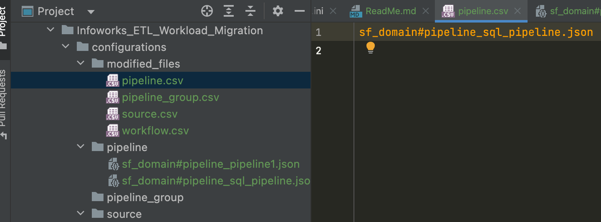

# Infoworks ETL Workload Migration

Product Compatibility: IWX 5.3.1+

## Introduction
This product recepie is responsible for ETL Workload migration based on predefined JSON templates.

<br>
Supports Infoworks version 5.3 onwards

## Table of Contents
- [Introduction](#introduction)
- [Prerequisites](#prerequisites)
- [Installation](#installation)
- [Usage](#usage)
- [Authors](#authors)

# Prerequisites

- The VM server where you are running this script should be able to talk to IWX environment on the 3001/443 port
- Infoworks Environment should have the environment created with the necessary storage and compute interactive cluster.
- The License key should be installed in the Infoworks environment with all the required source connector options.
- Ensure that the interactive clusters are up and running prior to running below scripts.
- The user must have access to the domain in which the pipelines/workflows are supposed to be created.
- Any secrets,extensions,target_data_connections,prehooks, posthooks etc created should be manually migrated prior to this process.


# Installation

The script will automatically install infoworkssdk required to perform ETL Workload migrations when executed.

# Limitations


# What are the considerations and steps for ETL Workload Migration integration with Infoworks?

## Migration of Artifacts

### Sources
- Creates source and maps it with environment
- Configure the connection details for the source
- Browse the source for the tables based on filter criteria if any
- Add the browsed tables and metacrawl the tables
- Configure the tables ingestion configurations(Natural keys,watermark column, split by, partition by, advance configurations, etc.)
- Create and configure the table groups

### Pipelines

- Creates the domain for pipeline if doesn’t exist already
- Creates pipeline and attach it to the compute
- Configure the pipeline using the pipeline model from lower environment
- Advance configuration if any

### Workflows

- Creates workflows
- Configures workflow

# Infoworks Developer flow:

- Download the package
```bash
wget --no-check-certificate https://infoworks-releases.s3.amazonaws.com/Infoworks_ETL_Workload_Migration.tar.gz
```
- Untar the downloaded Package.
```bash
tar -xvf Infoworks_ETL_Workload_Migration.tar.gz
```
- cd to the repo directory.
```bash
cd Infoworks_ETL_Workload_Migration
```
- Prepare the JSON Files for Sources,Pipelines, and Workflows that are supposed to be migrated as per the sample templates provided under sample_templates directory
  
  Place the JSON under 
  - configurations/source for Sources
  - configurations/pipeline for Pipelines
  - configurations/workflow for Workflows

# Files/Directory structure

- config.ini: Contains all the parameters and the mappings required for the migration process.
- configurations directory: Storage for all the required JSONs of the sources/pipelines/workflows that are exported during the migration process. 

# Usage 

## Prepare the JSON file as per the below template and place the JSON files under below location:
```bash
./configurations/
```
**Note** : The keys marked with mandatory comment are supposed to be mandatorily passed by the user, rest of them can be ignored if they want to go with default values.

### Sources:
1) [RDBMS Source Sample JSON](./configurations/source/source_RDBMS_SQLServer.json)
2) [File based Source Sample JSON](./configurations/source/source_AR_CSV_TEST.json)

- JSON File Naming convention:
```file
./configurations/source/source_{iwx_source_name}.json
```

### Pipelines:
1) [Visual Pipeline Sample JSON](./configurations/pipeline/sf_domain%23pipeline_pipeline1.json)
2) [SQL Pipeline Sample JSON](./configurations/pipeline/sf_domain%23pipeline_sql_pipeline.json)

- JSON File Naming convention:
```file
./configurations/pipeline/{iwx_domain_name}#pipeline_{iwx_pipeline_name}.json
```

In case of SQL pipeline JSON:

Replace the query  section with your equivalent query in base64 encoded format:

If your query is:
```sql
create table sql_pipeline_1_table as select * from dev.customers;
select * from dev.orders;
```

Then its base64 encode equivalent is:
```base64
Y3JlYXRlIHRhYmxlIHNxbF9waXBlbGluZV8xX3RhYmxlIGFzIHNlbGVjdCAqIGZyb20gZGV2LmN1c3RvbWVyczsKc2VsZWN0ICogZnJvbSBkZXYub3JkZXJzOw==
```

Ensure to update the environmentName, warehouse, pipeline_parameters if any.
Save the file in the format {iwx_domain_name}#pipeline_{iwx_pipeline_name}.json


### Workflows:
1) [Workflow Sample JSON](./configurations/workflow/sf_domain%23workflow_CICD_WORKFLOW.json)

- JSON File Naming convention:
```file
./configurations/workflow/{iwx_domain_name}#workflow_{iwx_workflow_name}.json
```

### After placing JSON files under respective directories, mentioned the JSONs that you want to migrate
Update the modified_files/pipeline.csv with the json file name which we are interested in migrating.
For example: if my json file name is sf_domain#pipeline_sql_pipeline.json
Where,
sf_domain is my domain name
sql_pipeline is my pipeline name



same is applicable for sources/workflows.

### Edit the config.ini as per the mapping needs.

For instance,  you would need to map the preprod environment name to prod environment name, you can do so with the config.ini as follows:

```ini
[api_mappings]
ip=10.28.1.95
port=3001
protocol=http
maintain_lineage=false
refresh_token=<your_infoworks_refresh_token>
env_tag=PRD
[environment_mappings]
PRE_PROD_SNOWFLAKE=PROD_SNOWFLAKE
[storage_mappings]
PRE_PROD_DEFAULT_STORAGE=PROD_DEFAULT_STORAGE
[compute_mappings]
PRE_PROD_DEFAULT_PERSISTENT_COMPUTE=PROD_DEFAULT_PERSISTENT_COMPUTE
[table_group_compute_mappings]
PRE_PROD_DEFAULT_PERSISTENT_COMPUTE=PROD_DEFAULT_PERSISTENT_COMPUTE
DEFAULT_DEMO_COMPUTE_CLUSTER=Default_Persistent_Compute_Template
```

In the above file:

[api_mappings]

**Note**:
- User must provide this section which will be necessary for making any Infoworks REST API calls.

Contains information about target machine (host,port,infoworks user refresh token etc)
port: rest api port of lower environment.(3001 for http,443 for https)


Note:
If there are any customer specific changes that are supposed to happen like schema name change during the CICD process they can do so by following the below format for section name in config.ini
```ini
[configuration$source_configs$data_lake_schema]
DEMO_CSV_Schema=DEMO_CSV_Schema_PRD
PUBLIC=PUBLIC_PRD
```

You need to specify the path in the json where the particular key appears separated by $.
For cases where you want to give regex pattern instead of actual key name to match criteria for multiple pipelines you can give regex as follows:

```ini
[configuration$pipeline_configs$model$nodes$SNOWFLAKE_TARGET_.*$properties$database_name]
TEST_DATABASE=PRD_DATABASE
```

In the above example, we can match multiple snowflake target table( SNOWFLAKE_TARGET_ABCD,SNOWFLAKE_TARGET_DEFG etc) properties instead of individually specifying section for each keys.
#### Note:
(The above feature is available only starting from Infoworks SDK versions infoworkssdk >= 3.0a3)

In case the json has array of json values, you could use * instead of giving actual index number in section name of config.ini
For example:
```ini
[configuration$pipeline_configs$pipeline_parameters$*$value]
SUPPORT_DB=PRD_DB
```
“*” in the above section indicates the value variable can be in any index of the pipeline_parameters array.
```json
{
   "configuration": {
       "pipeline_configs": {
           "type": "sql",
           "query": "Y3JlYXRlIHRhYmxlIHNxbF9waXBlbGluZV8xX3RhYmxlIGFzIHNlbGVjdCAqIGZyb20gY3VzdG9tZXJz", //pragma: allowlist secret
           "pipeline_parameters": [
               {
                   "key": "DB_NAME",
                   "value": "SUPPORT_DB"
               }
           ],
           "batch_engine": "SNOWFLAKE",
           "query_tag": "dev",
           "description": ""}}}
```

### If running from a local VM, run the below command. This script is responsible for importing the artifact on the target machine whose details are present in config.ini.

```bash
chmod +x main.py; 
python3 main.py --config_ini_file <path to config.ini file>
```

# Authors
Nitin BS - nitin.bs@infoworks.io