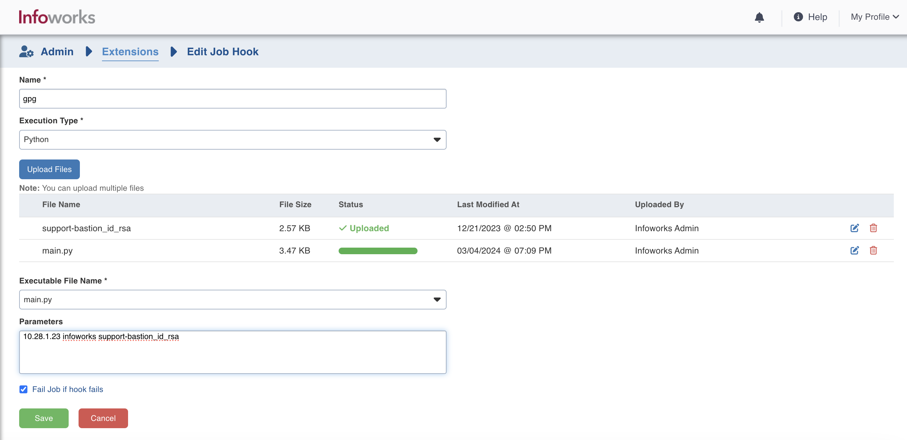

# Prehook Script for Decrypting GPG Encrypted Files

## Overview
This prehook script connects to a Linux server hosting GPG encrypted files and decrypts them using the GPG decrypt utility. It's meant to be executed before triggering the ingestion job for a specific table in a Databricks cluster.

## Features
1) Establishes SSH connection to the Linux server hosting the encrypted files.
2) Generates a list of encrypted files associated with the Infoworks table.
3) Decrypts files using the GPG decrypt command, assuming that the gpg utility is installed in the linux server.
4) Moves decrypted files to a designated subdirectory based on specified criteria.

## Usage

1) Login to Infoworks User Interface
2) Navigate to Admin > Extensions > Job Hooks. 
   - Create a job hook with the desired name and upload the scripts along with the ssh key file.
   
   - Pass the below mentioned command line parameters to the script.
   - $1 - First argument - hostname/IP of the SFTP host
   - $2 - Second argument - username of the SFTP host
   - $3 - Third argument - Private key file name which will be used for gpg encryption.
3) The uploaded job hook should be attached to the infoworks source.
   - Source Setup > Job Hooks > Attach your job hook created in step 3.

## Directory Structure

- bash_version/: Contains the Bash version of the gpg prehook script.
- python_version/: Contains the Python version of the gpg prehook script.

## Compatibility
Both versions of the script serve the same purpose and can be used interchangeably.

