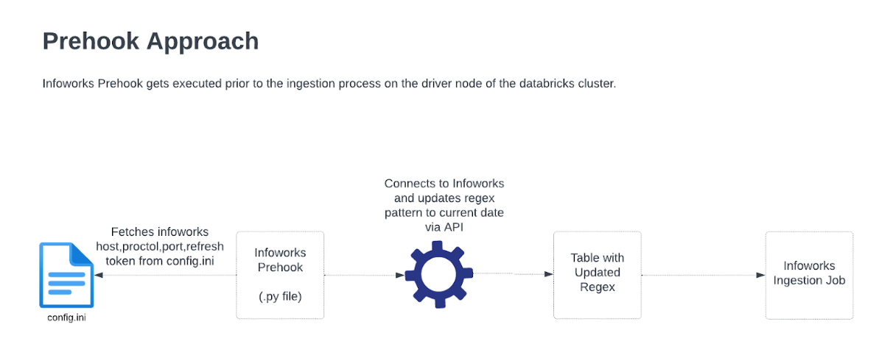
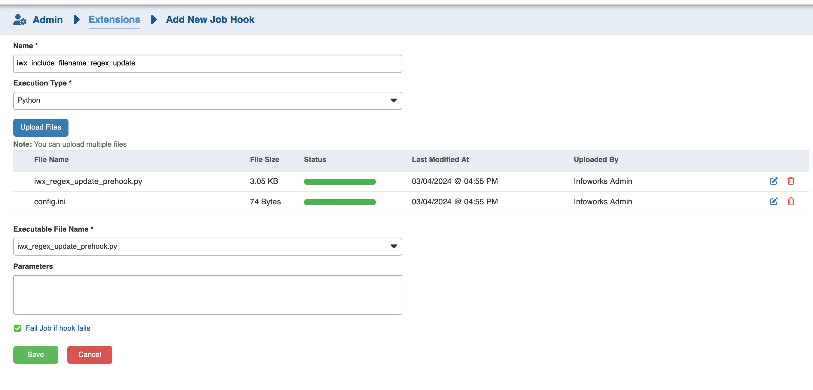
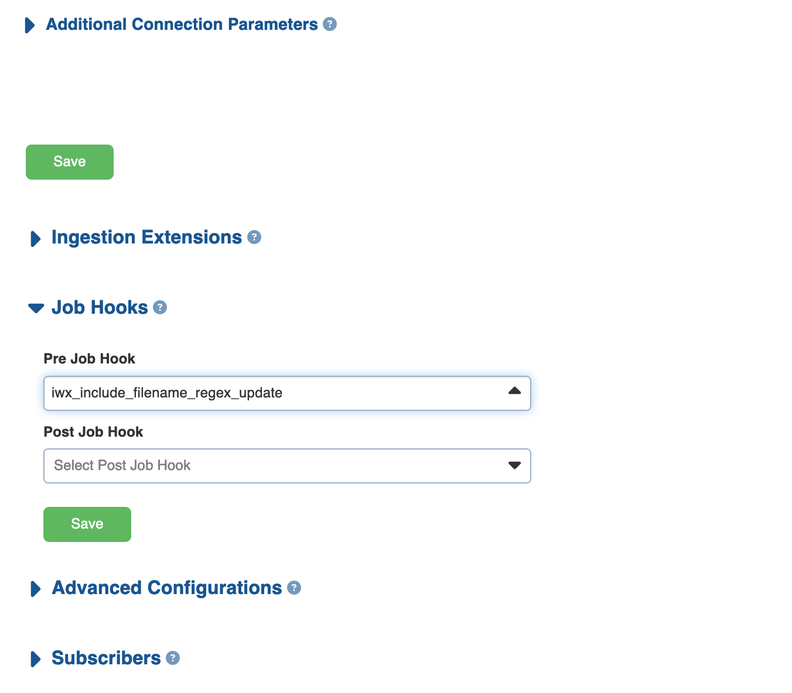

# Infoworks include regex pattern update Prehook Scripts

## Introduction
Scripts in this directory are the samples for Updating the include file name regex pattern for file based sources in Infoworks.

## Prerequisites
* Infoworks 5.3.x+ (not compatible with earlier version of Infoworks)

## Example Prehook Scripts:

## 1. Update the include filename regex to pick the file based on current date/timestamp.
[iwx_update_include_filename_regex_to_current_date.py](./iwx_update_include_filename_regex_to_current_date.py)
### Introduction

Pre hook script is executed prior to the infoworks ingestion process, it updates the regex pattern of the table to current date. The Infoworks ingestion process uses the current date regex and extract files to ingest.

### Flow Diagram:

### Installation and Usage:

1) Populate [config.ini](./config.ini) file with the required properties like HOST,PORT,PROTOCOL & REFRESH_TOKEN, which are required for making Infoworks API calls.
2) Login to Infoworks User Interface
3) Navigate to Admin > Extensions > Job Hooks. 
- Create a job hook with the desired name and upload both .py script and config.ini file.

4) The uploaded job hook should be attached to the infoworks source.
- Source Setup > Job Hooks > Attach your job hook created in step 3.

## 2. Update the include filename regex pattern to pick the latest file based on file modified timestamp.

### Introduction

Pre hook script is executed prior to the infoworks ingestion process, it updates the regex pattern of the table to the latest file name based on file modified timestamp. The Infoworks ingestion process uses the current date regex and extract files to ingest.
[iwx_update_include_filename_regex_to_latest_filename.py](./iwx_update_include_filename_regex_to_latest_filename.py)

### Flow Diagram:

### Installation and Usage:

1) Populate [config.ini](./config.ini) file with the required properties like HOST,PORT,PROTOCOL & REFRESH_TOKEN, which are required for making Infoworks API calls.
2) Login to Infoworks User Interface
3) Navigate to Admin > Extensions > Job Hooks. 
- Create a job hook with the desired name and upload both .py script and config.ini file.

4) The uploaded job hook should be attached to the infoworks source.
- Source Setup > Job Hooks > Attach your job hook created in step 3.

